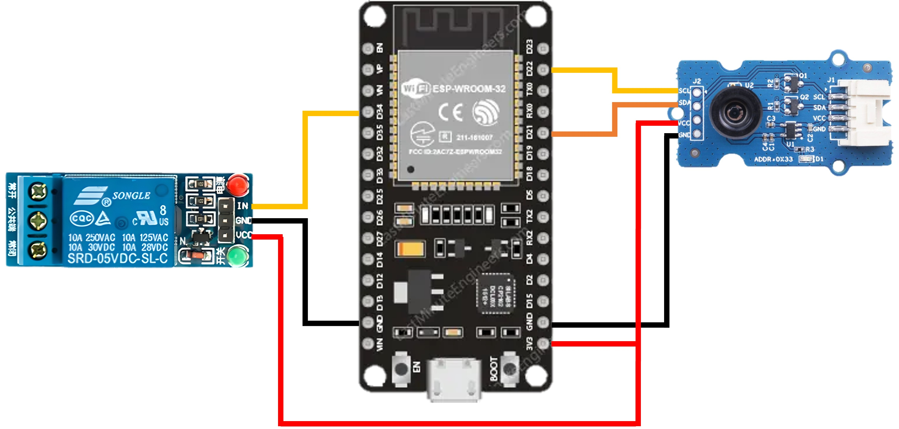

# ESP32-S3 Fire Redundant System using IR Thermal Imaging

This project demonstrates a **fire detection and response system** using an **ESP32-S3**, an **MLX90640 IR thermal camera**, and a **relay-actuated fire extinguisher**. It detects high-temperature zones using thermal imaging and automatically activates an actuator while sending a real-time alert over WiFi.

---

## 🎬 Demo Result


📽️ **[Watch detailed Result Video](docs/result_demo.mp4)**
- Fire simulated with a heat source
- Relay activates for 2 minutes
- WiFi alert is sent to a server endpoint

---

## 🔧 Hardware Pin Allotment

| Component         | ESP32-S3 Pin | Description                 |
|------------------|--------------|-----------------------------|
| Relay Module      | GPIO34       | Controls fire extinguisher  |
| MLX90640 Sensor   | I2C (SDA/SCL)| SDA: GPIO21, SCL: GPIO22    |
| Actuator (via Relay)| External Power | 5V/12V depending on load |



---

## 💡 Features

- Thermal sensing with MLX90640 (32x24 pixels)
- Configurable temperature threshold
- 2-minute relay trigger for actuator
- WiFi-enabled HTTP alert for remote monitoring
- Modular and extensible code

---

## 📂 Project Files

- `FireSystem.ino` – Main Arduino sketch
- `include/secrets.h` – WiFi and server settings
- `docs/pin_diagram.png` – Visual pin mapping
- `docs/result_demo.mp4` – System demo video

---

## 🚀 How to Run (Execution Steps)

1. **Install Required Libraries** in Arduino IDE:
   - Adafruit MLX90640
   - WiFi
   - HTTPClient

2. **Create `include/secrets.h`** file:
    ```cpp
    #pragma once
    #define WIFI_SSID "YourSSID"
    #define WIFI_PASSWORD "YourPassword"
    #define FIRE_ALERT_URL "http://your-server.com/fire-alert"
    ```

3. **Connect the hardware** as per `docs/pin_diagram.png`.

4. **Upload `FireSystem.ino`** to your ESP32-S3 via Arduino IDE.

5. **Open Serial Monitor** at `115200` baud to view live status.

---

## 🔐 Security Note

Do **not** upload your `secrets.h` file to GitHub. It’s already excluded via `.gitignore`.

---